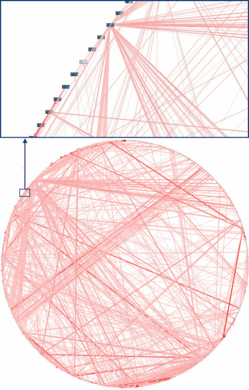

实验一： 依赖分析与依赖图
======================================
.. raw:: html

   

   作者：朱文琦 洪仪 许璐怡 诸斯涔

.. raw:: html

    

   来源：浙江师范大学

.. raw:: html

   &nbsp;&nbsp;&nbsp;&nbsp;

   日期：2021/05/16

.. raw:: html

   

摘要
------------------
在开发软件的过程中，我们发现随着时间的推移，那些没有合理架构的软件将会逐渐变得粗糙和混乱不堪。而正因如此，我们需要对软件进行依赖分析，为软件设计好一个合理的架构体系，提高软件系统的健壮性并避免软件结构混乱的问题出现。

在该实验中，我们需要借助putty、snakefood以及mermaid等工具对现有项目EnglishPal进行依赖分析。通过对模块以及函数之间依赖关系的分析，我们给出了对于该项目健康程度的分析总结。

介绍
------------------
大多数软件架构人员在开发软件过程中会遇到业务逻辑混乱的问题，导致软件结构陷入一个“大泥团”中的混乱结构中，如：纱线依赖、蚕茧依赖、琵琶鱼依赖等,如图1所示：

.. raw:: html

   

图一 现实生活中的依赖关系图

.. raw:: html

   

实验过程
------------------

实验工具
>>>>>>>>>>>>>>>>>>
putty
::::::::::::::::::

snakefood
::::::::::::::::::

mermaid
::::::::::::::::::

实验方法
>>>>>>>>>>>>>>>>>>

实验结果
------------------

py文件间的依赖
>>>>>>>>>>>>>>>>>>

function间的依赖
>>>>>>>>>>>>>>>>>>

实验总结
------------------

实验代码
------------------

参考资料
------------------
1. Harry Percival and Bob Gregory. Architecture Patterns with Python. O’Reilly Media; 1st edition (March 31, 2020)
2. Alex Papadimoulis 《Enterprise Dependency: Big Ball of Yarn》