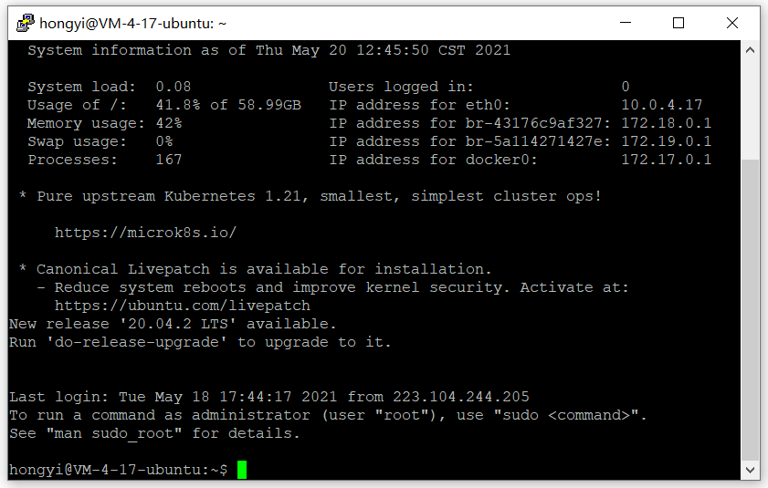
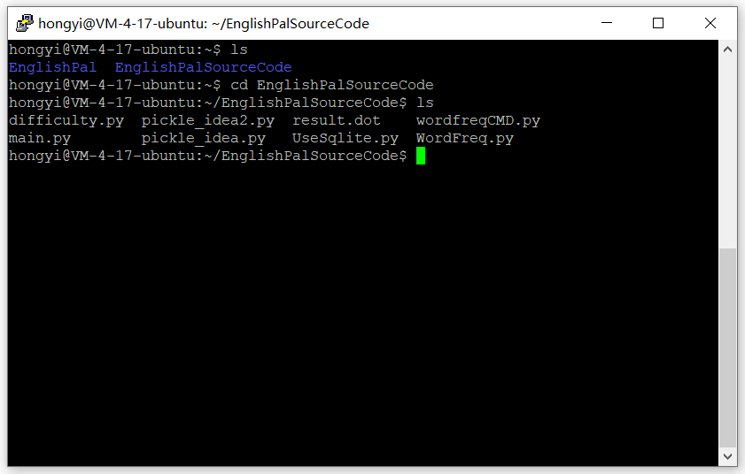
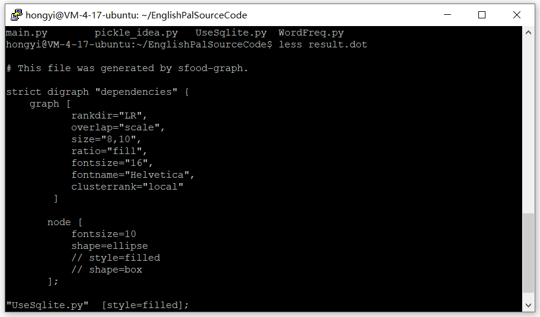
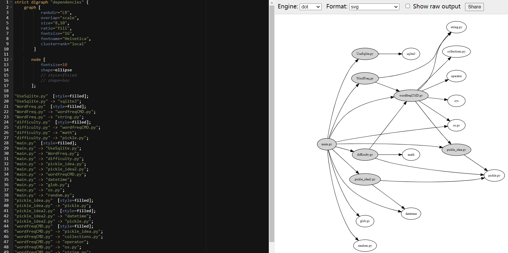
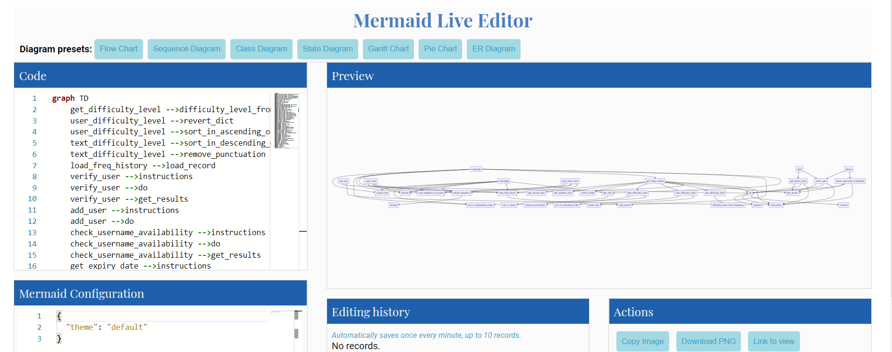
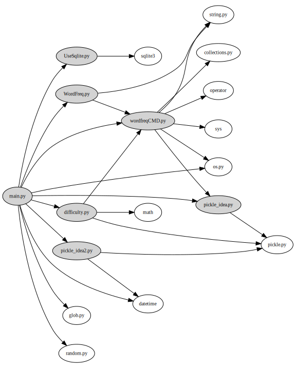

实验一： 依赖分析与依赖图
======================================
.. raw:: html

   

   作者：朱文琦 洪仪 许璐怡 诸斯涔

.. raw:: html

    

   来源：浙江师范大学

.. raw:: html

   &nbsp;&nbsp;&nbsp;&nbsp;

   日期：2021/05/16

.. raw:: html

   

摘要
------------------
在开发软件的过程中，我们发现随着时间的推移，那些没有合理架构的软件将会逐渐变得粗糙和混乱不堪。控制代码各部分之间（或代码使用的项目之间）的依赖关系是提高代码可重用性的一种有效方法：源代码体的依赖关系越少，将来该代码可用的可能性就越大。而正因如此，我们需要对软件进行依赖分析，为软件设计好一个合理的架构体系，提高软件系统的健壮性并避免软件结构混乱的问题出现。

在该实验中，我们需要借助putty、Snakefood以及mermaid等工具对现有项目EnglishPal进行依赖分析。通过对模块以及函数之间依赖关系的分析，我们给出了对于该项目健康程度的分析总结。

介绍
------------------
大多数软件架构人员在开发软件过程中会遇到业务逻辑混乱的问题，导致软件结构容易陷入一个“大泥团”中的混乱结构中，如图1所示：

.. raw:: html

   

.. image::  images/apwp_0001.png

图一 现实生活中的依赖关系图

.. raw:: html

   

为了避免这种情况的发生，我们需要对软件结构进行依赖分析。因此，在这个实验里，我们研究EnglishPal源代码中模块（或类）之间的依赖关系，这将有助于我们了解目前EnglishPal的健康水平。例如，如果模块A使用模块B中的东西，我们就可以认为模块A依赖于模块B：在Python中，import语句就是一个很好的依赖性指示符，而这种模块级的依赖关系可以通过Snakefood之类的工具进行捕获。控制代码各部分之间（或代码使用的项目之间）的依赖关系是提高代码可重用性的一种有效方法：源代码体的依赖关系越少，将来该代码可用的可能性就越大。

对于更细致层次的分析，由于没有合适的分析工具，所以我们将借助mermaid工具手动绘制EnglishPal的类/函数级依赖关系图。

实验过程
------------------

实验工具
>>>>>>>>>>>>>>>>>>
Putty
::::::::::::::::::
PuTTY是一款开源的连接软件，主要由Simon Tatham维护，使用MIT许可证授权，默认登录协议是SSH，默认的端口为22。Putty是用来远程连接服务器的，支持SSH、Telnet、Serial等协议的连接。其中最常用的是SSH，用它来远程管理Linux十分好用。

Snakefood
::::::::::::::::::
Snakefood是一种用于捕获多个python文件的模块之间的依赖关系的工具，允许用户借助Graphviz自动生成这些依赖关系的可视化图形。

Graphviz
::::::::::::::::::
Graphviz是一款由AT&T Research和Lucent Bell实验室开源的可视化图形工具，可以很方便的用来绘制结构化的图形网络，支持多种格式输出。

Mermaid
::::::::::::::::::
Mermaid是一款开源的，用文本语法来描述文档图形(流程图、 时序图、甘特图)的工具，您可以在文档中嵌入一段Mermaid文本来生成SVG形式的图形。

实验方法
>>>>>>>>>>>>>>>>>>
在本次实验中，我们需要借用老师提供的服务器账号，使用其中的Snakefood工具。

因此，我们首先需使用putty连接到老师提供的服务器，远程连接界面如图二所示：

.. raw:: html

   

图二 Putty连接界面

.. raw:: html

   

连接服务器后我们使用账号登录，登录成功界面如图三所示：

.. raw:: html

   

图三 Putty成功登录界面

.. raw:: html

   

在登录后，通过git clone指令，我们将EnglishPal项目代码拷贝过来，并创建一个放置所有py文件的新文件夹，将EnglishPal项目中的所有python文件复制一份到该文件夹中，如图四所示。

.. raw:: html

   

图四 拷贝python文件

.. raw:: html

   

复制完毕文件后，我们可以执行sfood . | sfood-graph > result.dot代码，通过Snakefood工具，生成依赖关系图的dot文件。通过执行less指令，我们就可以查看dot文件中的内容，如图五所示。

.. raw:: html

   

图五 生成依赖图的dot文件

.. raw:: html

   

将生成的代码拷贝到Graphviz中，我们就可以获得EnglishPal项目的模块依赖关系图，如图六所示。

.. raw:: html

   

图六 使用Graphviz得到项目的模块依赖关系图

.. raw:: html

   

我们对EnglishPal项目的模块依赖关系分析就到此结束，之后就需要我们在对项目的类与函数的依赖关系进行分析后，借助Mermaid工具对依赖关系图进行绘制，如图七所示。

.. raw:: html

   

图七 使用Mermaid得到项目的函数依赖关系图

.. raw:: html

   

使用Snakefood生成的dot文件及使用Mermaid生成依赖图的代码都将附在之后的实验代码部分。

实验结果
------------------

py文件间的依赖
>>>>>>>>>>>>>>>>>>
.. raw:: html

   

图八 py文件间的依赖关系图

.. raw:: html

   

function间的依赖
>>>>>>>>>>>>>>>>>>

.. raw:: html

   

图九 类和函数间的依赖关系图

.. raw:: html

   

实验总结
------------------

实验代码
------------------

Snakefood生成的dot文件
>>>>>>>>>>>>>>>>>>>>>>>>>>>>>>

::

    strict digraph "dependencies" {
        graph [
               rankdir="LR",
               overlap="scale",
               size="8,10",
               ratio="fill",
               fontsize="16",
               fontname="Helvetica",
               clusterrank="local"
            ]
           node [
               fontsize=10
               shape=ellipse
               // style=filled
               // shape=box
           ];
    "UseSqlite.py"  [style=filled];
    "UseSqlite.py" -> "sqlite3";
    "WordFreq.py"  [style=filled];
    "WordFreq.py" -> "wordfreqCMD.py";
    "WordFreq.py" -> "string.py";
    "difficulty.py"  [style=filled];
    "difficulty.py" -> "wordfreqCMD.py";
    "difficulty.py" -> "math";
    "difficulty.py" -> "pickle.py";
    "main.py"  [style=filled];
    "main.py" -> "UseSqlite.py";
    "main.py" -> "WordFreq.py";
    "main.py" -> "difficulty.py";
    "main.py" -> "pickle_idea.py";
    "main.py" -> "pickle_idea2.py";
    "main.py" -> "wordfreqCMD.py";
    "main.py" -> "datetime";
    "main.py" -> "glob.py";
    "main.py" -> "os.py";
    "main.py" -> "random.py";
    "pickle_idea.py"  [style=filled];
    "pickle_idea.py" -> "pickle.py";
    "pickle_idea2.py"  [style=filled];
    "pickle_idea2.py" -> "datetime";
    "pickle_idea2.py" -> "pickle.py";
    "wordfreqCMD.py"  [style=filled];
    "wordfreqCMD.py" -> "pickle_idea.py";
    "wordfreqCMD.py" -> "collections.py";
    "wordfreqCMD.py" -> "operator";
    "wordfreqCMD.py" -> "os.py";
    "wordfreqCMD.py" -> "string.py";
    "wordfreqCMD.py" -> "sys";
    }

使用Mermaid生成依赖图的代码
>>>>>>>>>>>>>>>>>>>>>>>>>>>>>>

::

    graph TD
        get_difficulty_level -->difficulty_level_from_frequency
        user_difficulty_level -->revert_dict
        user_difficulty_level -->sort_in_ascending_order
        text_difficulty_level -->sort_in_descending_order
        text_difficulty_level -->remove_punctuation
        load_freq_history -->load_record
        verify_user -->instructions
        verify_user -->do
        verify_user -->get_results
        add_user -->instructions
        add_user -->do
        check_username_availability -->instructions
        check_username_availability -->do
        check_username_availability -->get_results
        get_expiry_date -->instructions
        get_expiry_date -->do
        get_expiry_date -->get_results
        get_today_article -->instructions
        get_today_article -->do
        get_today_article -->get_results
        get_today_article -->load_freq_history
        get_today_article -->get_difficulty_level
        get_today_article -->user_difficulty_level
        get_today_article -->text_difficulty_level
        get_today_article -->within_range
        get_today_article -->get_question_part
        get_today_article -->get_answer_part
        mark_word -->load_freq_history
        mark_word -->dict2lst
        mark_word -->merge_frequency
        mark_word -->save_frequency_to_pickle
        mainpage -->get_freq
        mainpage -->load_freq_history
        mainpage -->dict2lst
        mainpage -->merge_frequency
        mainpage -->save_frequency_to_pickle
        mainpage -->sort_in_descending_order
        mainpage -->youdao_link
        user_mark_word -->load_freq_history
        user_mark_word -->dict2lst
        user_mark_word -->merge_frequency
        user_mark_word -->save_frequency_to_pickle
        userpage -->get_freq
        userpage -->load_record
        userpage -->get_today_article
        userpage -->load_freq_history
        userpage -->dict2lst
        userpage -->sort_in_descending_order
        userpage -->youdao_link
        signup -->check_username_availability
        signup -->verify_user
        login -->verify_user
        login -->get_expiry_date
        merge_frequency -->lst2dict
        do -->connect
        do -->instructions
        do -->operate
        get_freq -->sort_in_desce

参考资料
------------------
1. Harry Percival and Bob Gregory. Architecture Patterns with Python. O’Reilly Media; 1st edition (March 31, 2020)
2. Alex Papadimoulis 《Enterprise Dependency: Big Ball of Yarn》

